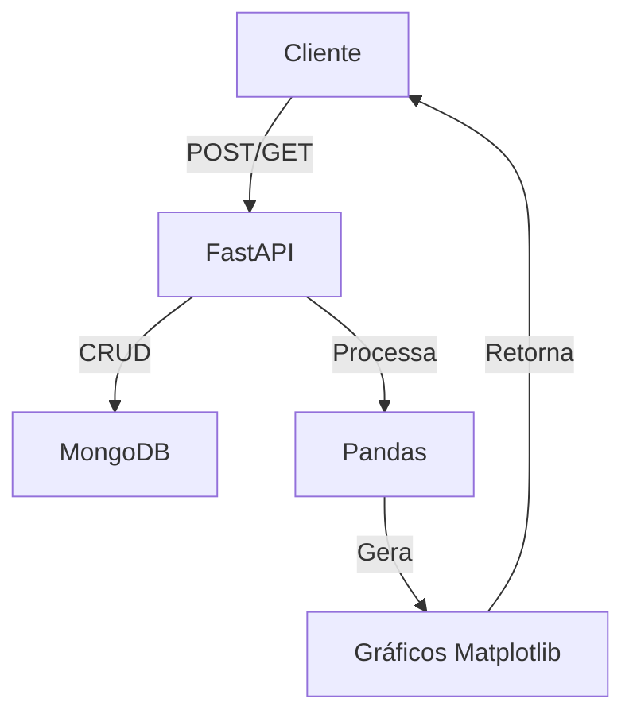

```markdown
# 🚀 API de Eventos Esportivos do DF

## 1 **Instalação das Dependências**

```bash
pip install fastapi uvicorn pymongo pandas seaborn matplotlib python-multipart
```

## 2 **Configuração do MongoDB**

1. Crie um cluster no [MongoDB Atlas](https://www.mongodb.com/atlas)
2. Configure um usuário com permissões de leitura/escrita
3. Substitua na conexão:

```python
client = MongoClient(
    "mongodb+srv://<USUARIO>:<SENHA>@cluster0.0ohfzwd.mongodb.net/eventosDF"
    "?retryWrites=true&w=majority&appName=Cluster0"
)
```

## **Estrutura Principal**

### 1. Imports Essenciais
```python
from fastapi import FastAPI, UploadFile, File
from fastapi.responses import FileResponse
from pydantic import BaseModel
from pymongo import MongoClient
import pandas as pd
import seaborn as sns
import matplotlib.pyplot as plt
import numpy as np
import uuid
import os
```

### 2. Modelo de Dados Pydantic
```python
class Evento(BaseModel):
    nome: str
    data: str
    local: str
    tipo: str
    publico_estimado: int
    custo: float
    descricao: str
    regiao: str
```

## 🌐 **Endpoints Principais**

### 📝 CRUD de Eventos
| Método | Endpoint            | Descrição                          |
|--------|---------------------|-----------------------------------|
| POST   | `/eventos`          | Cadastra novo evento              |
| GET    | `/eventos`          | Lista todos os eventos            |
| POST   | `/eventos/upload-csv` | Importa eventos via CSV          |
| GET    | `/eventos/exportar-csv` | Exporta eventos para CSV       |

### 📊 Endpoints de Gráficos
```markdown
- `GET /graficos/eventos-2semestre-2025`
- `GET /graficos/distribuicao-eventos-por-regiao` 
- `GET /graficos/top10-investimento`
- `GET /graficos/top10-publico`
```

## 🖼️ **Exemplo de Gráfico Gerado**


## 🚀 **Executando a API**

```bash
uvicorn main:app --reload
```

Acesse a documentação interativa em:
`http://localhost:8000/docs`

## 💾 **Fluxo de Dados**



## 📌 **Boas Práticas Implementadas**

- Validação de dados com Pydantic
- Gerenciamento seguro de arquivos temporários
- Tratamento de erros básico
- Documentação automática via Swagger
- Visualizações estatísticas profissionais

> ⚠️ **Importante**: Não exponha credenciais do MongoDB no código fonte! Use variáveis de ambiente.
```